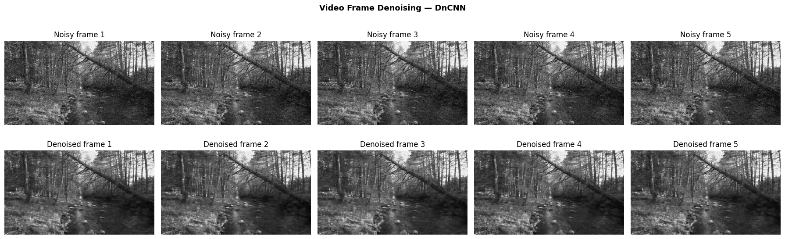

# Video Denoising Pipeline

[](https://colab.research.google.com/github/preeti-chauhan/video-denoising-pipeline/blob/main/video_denoising_pipeline.ipynb)
[](https://github.com/preeti-chauhan/video-denoising-pipeline/blob/main/video_denoising_pipeline.ipynb)

Classical DSP vs. deep learning (DnCNN) for frame-by-frame video denoising.

## Overview

Builds a complete video denoising pipeline covering:
- **Data pipeline** — patch extraction, noise synthesis, train/val/test splits
- **Classical baselines** — Gaussian filter, Wiener filter, Total Variation
- **DnCNN** — residual CNN denoiser implemented in PyTorch (Zhang et al., 2017)
- **Quantitative evaluation** — PSNR & SSIM comparison across all methods
- **Video processing** — frame-by-frame inference, output video reconstruction

## Architecture — DnCNN

```
Input (noisy) → Conv+ReLU → [Conv+BN+ReLU] × 15 → Conv → subtract → Output (clean)
```

The network predicts the **noise residual**; the clean image is recovered as:
```
clean = noisy − DnCNN(noisy)
```

## Training Details

- **Data** — 149 frames extracted from `clip.mp4` (80/10/10 train/val/test split)
- **Optimizer** — Adam, lr=1e-3, StepLR decay (×0.5 every 10 epochs)
- **Epochs** — 20 · **Batch size** — 32 · **Patch size** — 64×64
- **Noise level** — σ=25/255 · **Loss** — MSE on noise residual
- **Device** — GPU (Colab T4)

## Results

| Method           | PSNR (dB) ↑ | SSIM ↑ |
|------------------|-------------|--------|
| Noisy input      | ~20         | ~0.40  |
| Gaussian filter  | ~27         | ~0.75  |
| Wiener filter    | ~28         | ~0.78  |
| Total Variation  | ~28         | ~0.80  |
| **DnCNN**        | **~30+**    | **~0.87+** |

*Results vary by noise level (default σ=25/255) and number of training epochs.*

## Requirements

```
pip install torch torchvision numpy scipy matplotlib scikit-image opencv-python Pillow
```

## Usage

```bash
jupyter notebook video_denoising_pipeline.ipynb
```

Or open in Colab via the badge above — no local setup needed.

## Video Outputs



*Clean · Noisy · Gaussian · Wiener · Total Variation · DnCNN — with PSNR scores*

> Full videos (play in browser): [`synthetic_noisy.mp4`](https://github.com/preeti-chauhan/video-denoising-pipeline/blob/main/synthetic_noisy.mp4) · [`denoised_output.mp4`](https://github.com/preeti-chauhan/video-denoising-pipeline/blob/main/denoised_output.mp4)

## Using Your Own Video

In Section 6, uncomment Option B:
```python
SYNTHETIC_VIDEO = 'your_video.mp4'
```

## Files

| File | Description |
|---|---|
| `video_denoising_pipeline.ipynb` | Main notebook |
| `clip.mp4` | Source video used for training (Big Buck Bunny, 5s) |
| `dncnn_weights.pth` | Saved model weights (generated after training) |
| `synthetic_noisy.mp4` | Noisy input video |
| `denoised_output.mp4` | DnCNN denoised output video |
| `README.md` | This file |

## References

- Zhang, K. et al. (2017). *Beyond a Gaussian Denoiser: Residual Learning of Deep CNN for Image Denoising.* IEEE TIP. [arXiv:1608.03981](https://arxiv.org/abs/1608.03981)

## Acknowledgements

Sample video: [Big Buck Bunny](https://peach.blender.org/) © Blender Foundation, licensed under [CC BY 3.0](https://creativecommons.org/licenses/by/3.0/).
